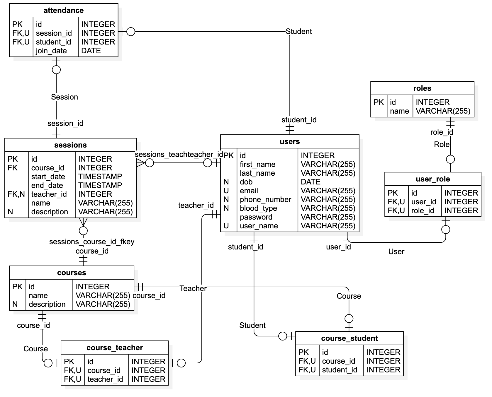
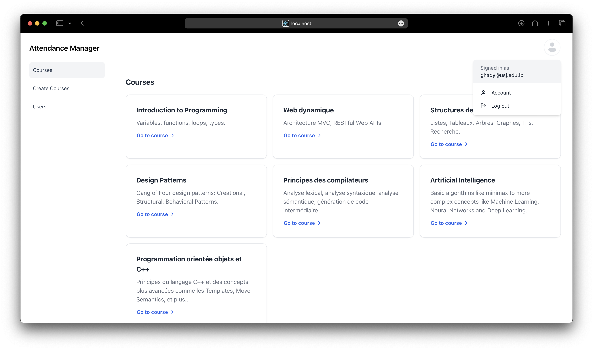
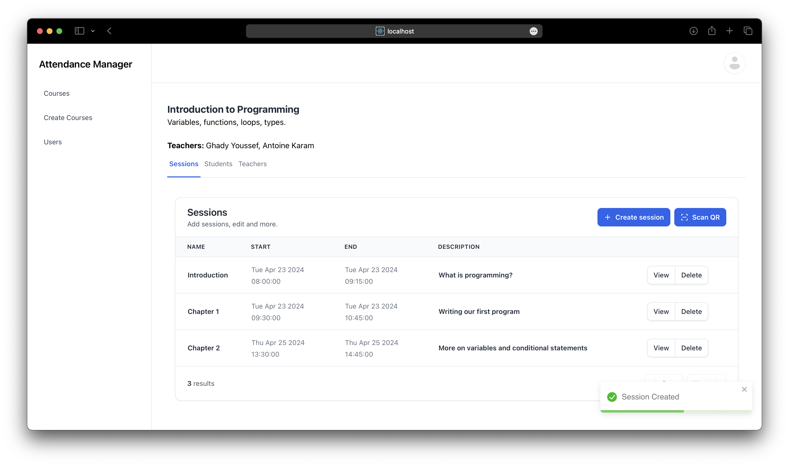
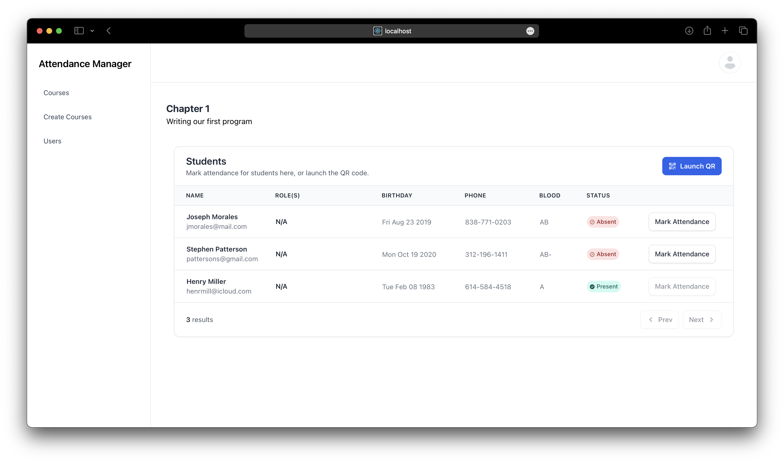
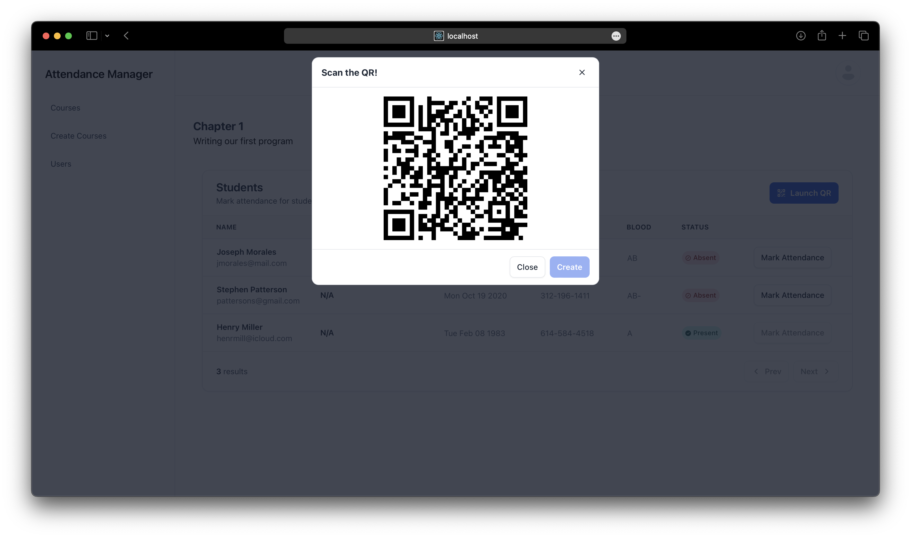
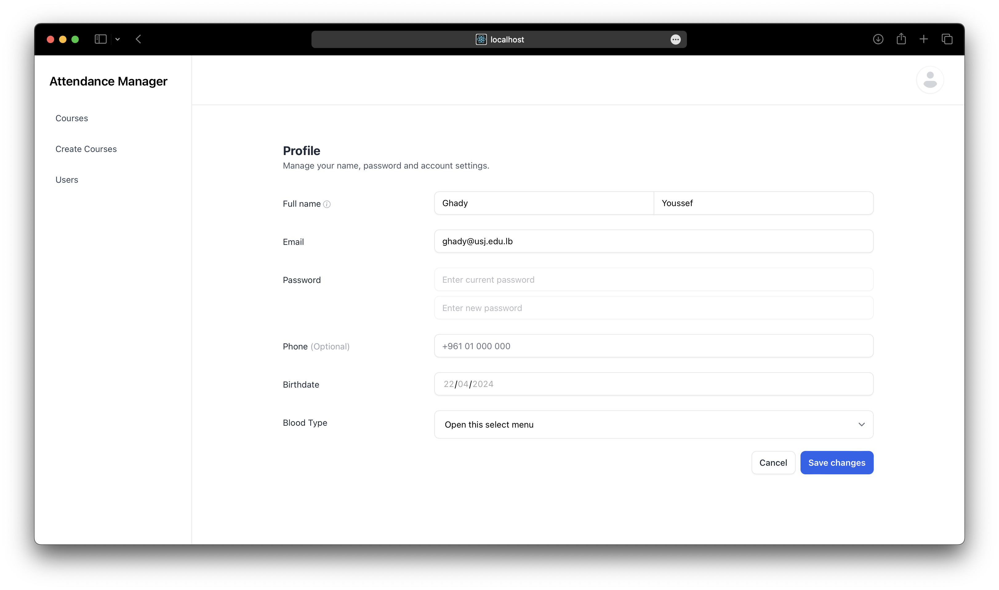
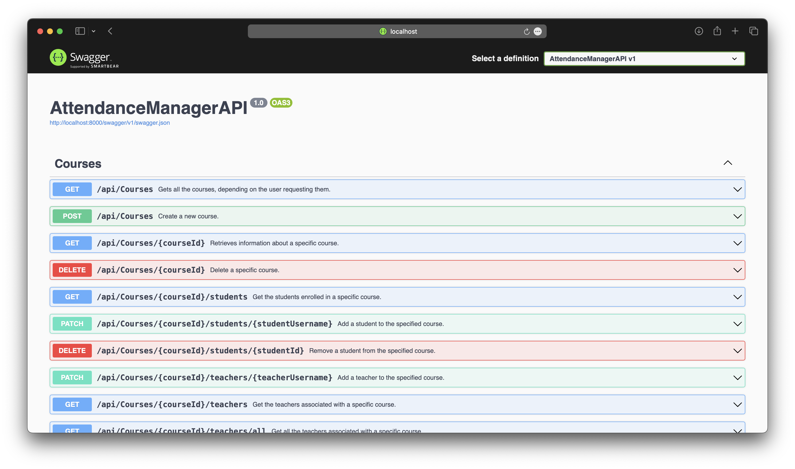

# Attendance Manager

## Table of contents

- [Description](#description)
- [Tech Stack](#tech-stack)
- [Installation guide](#installation-guide)
  - [Project structure](#project-structure)
  - [Getting started](#getting-started)
- [Features](#features)
- [Demo](#demo)

## Description

Attendance Manager is a platform that simplifies attendance taking for students aswell as for teachers. It is a centralized platform that allows teachers to create sessions and let the students mark their attendance on their own.

## Tech Stack

- Client (Frontend):
  1. React.js with **TypeScript**
  2. Preline, a UI component library
  3. Tailwind CSS, a CSS framework
  4. Additional libraries like `react-router-dom` for routing, `react-hook-form` for client-side validation and `react-toastify` for alerting users with toasts.
- Web API (Backend):
  1. ASP.NET Core Web API with **C#**
  2. Entity Framework
  3. PostgreSQL Database
  4. Swagger / OpenAPI (using the `Swashbuckle.AspNetCore` package)

## Installation guide

Ensure that you have the correct set of dependencies installed on your machine such as [Node.js](https://nodejs.org/en), the [.NET SDK](https://dotnet.microsoft.com/en-us/download) and a [PostgreSQL](https://www.postgresql.org/download/) database.

### Project structure

This project contains two main subdirectories:

```
api/
client/
```

The `api/` directory contains the ASP.NET project and the `client/` contains the React.js project.

### Getting started

First, please clone this repository using the following commands:

```
git clone https://github.com/Ghaadyy/attendance-manager.git
cd attendance-manager/
```

Now, let's setup the React app:

> Please note before running the React app you should create a `.env` file which will contain the following environment variable to indicate the API's URL.

Add the following env variable to the `.env` file:

```
REACT_APP_API_URL=http://<some_address>:8000/api // most likely localhost
```

To run the React app please run the following commands:

```
cd client/
npm install
npm run start
```

To run the ASP.NET app please run the following commands:

> Before running the API, please make sure to create a PostgreSQL database and add the proper connection string in the `appsettings.json` file.

```
cd api/
dotnet restore
dotnet build
dotnet run
```

Congrats, you should be up and running!
The React app should be available at `http://localhost:3000/ ` and the API at `http://localhost:8000/api/[controller]`.

## Database Design

Below is the _ER diagram_ that represents our database structure.



## Features

Our app contains the following features:

- Create, update, edit and delete users.
- Create courses with sessions.
- Add students and teachers.
- Manage security with roles.
- Allow students to mark their attendance using QR codes.
- Track students' attendance.
- Proper authentication and authorization using JWT.
- Friendly user interface achieved by pagination on every page.
- Using Swagger to document the API.

## Demo

Here you can find more about the core screens that are available in the app.

Here you can find the main screen of the app, the courses page, where each user can see the courses he is enrolled in, or teaching.


This page offers more details for each course allowing the teacher for example to create a session and take attendance.


Here is the session page, where the teacher can track the students' attendance to this specific session.


This is the QR code that the teacher shows to the students to allow them to mark their attendance.


This is a simple page that allows users to edit their profile.


This is our Swagger page, basically a documentation for our API.

